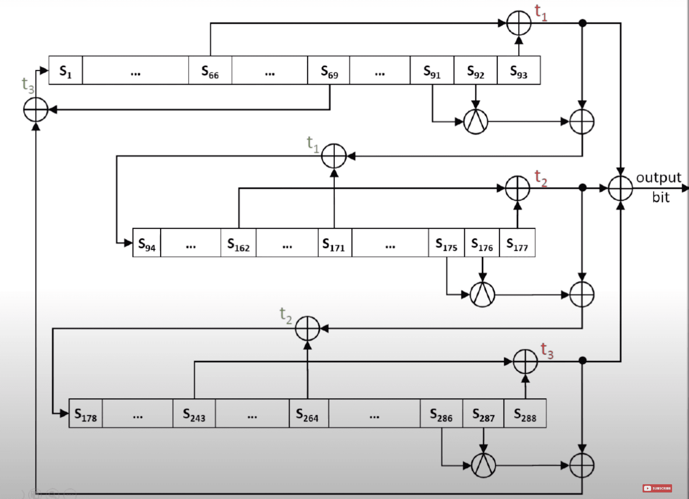

# Trivium

## Algorithm:
For $i = 1$ to $N$:
1. $t_1 \gets s_{66} + s_{93}$  
   $t_2 \gets s_{162} + s_{177}$  
   $t_3 \gets s_{243} + s_{288}$

2. $z_i \gets t_1 + t_2 + t_3$

3. Update $t_1, t_2, t_3$:  
   $t_1 \gets t_1 + s_{91} \cdot s_{92} + s_{171}$  
   $t_2 \gets t_2 + s_{175} \cdot s_{176} + s_{264}$  
   $t_3 \gets t_3 + s_{286} \cdot s_{287} + s_{69}$

4. Update the states:  
   $(s_1, s_2, \ldots, s_{93}) \gets (t_3, s_1, \ldots, s_{92})$  
   $(s_{94}, s_{95}, \ldots, s_{177}) \gets (t_1, s_{94}, \ldots, s_{176})$  
   $(s_{178}, s_{179}, \ldots, s_{288}) \gets (t_2, s_{178}, \ldots, s_{287})$

## Key and IV Setup:

1. Initialize the 288-bit state:

	$(s_1, s_2, \ldots, s_{93}) \gets (K_1, K_2, \ldots, K_{80}, 0, \ldots, 0)$

	$(s_{94}, s_{95}, \ldots, s_{177}) \gets (IV_1, IV_2, \ldots, IV_{80}, 0, \ldots, 0)$

	$(s_{178}, s_{179}, \ldots, s_{288}) \gets (0, \ldots, 0, 1, 1, 1)$

2. Perform 4 full rotations over the state (without generating keystream bits):
	
    $\text{for } i = 1 \text{ to } 4 \cdot 288 \text{ do}$
    
	1. Update $t_1, t_2, t_3$:
		
        $t_1 \gets s_{66} + s_{91} \cdot s_{92} + s_{93} + s_{171}$

		$t_2 \gets s_{162} + s_{175} \cdot s_{176} + s_{177} + s_{264}$

		$t_3 \gets s_{243} + s_{286} \cdot s_{287} + s_{288} + s_{69}$

	 1. Update the states:
		
        $(s_1, s_2, \ldots, s_{93}) \gets (t_3, s_1, \ldots, s_{92})$

		$(s_{94}, s_{95}, \ldots, s_{177}) \gets (t_1, s_{94}, \ldots, s_{176})$

		$(s_{178}, s_{179}, \ldots, s_{288}) \gets (t_2, s_{178}, \ldots, s_{287})$

## Bibliography
De Cannière, Christophe, and Bart Preneel. "Trivium: A Stream Cipher Construction Inspired by Block Cipher Design Principles."

Paar, Christof, and Jan Pelzl. Understanding Cryptography: A Textbook for Students and Practitioners. Springer, 2010.

Image: https://youtu.be/YCnUKCki_rg?si=w8F02K3jg50yUwNI&t=234